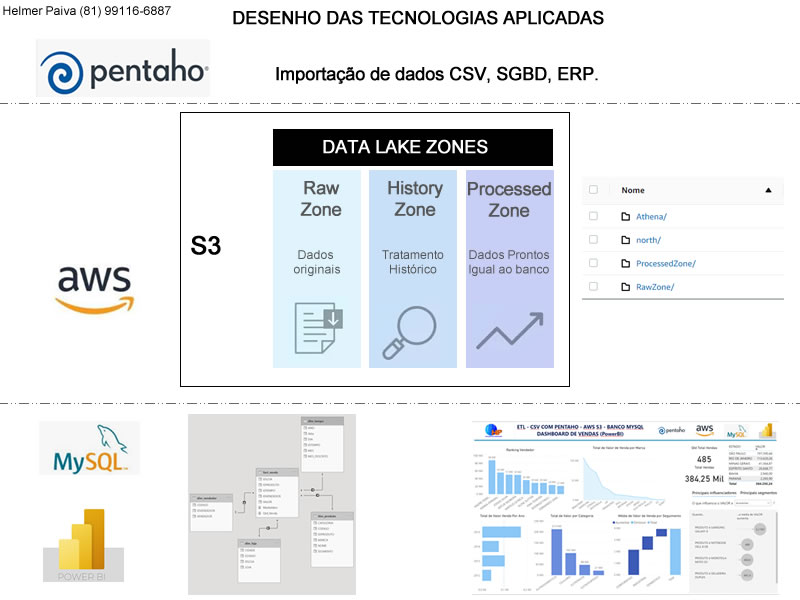
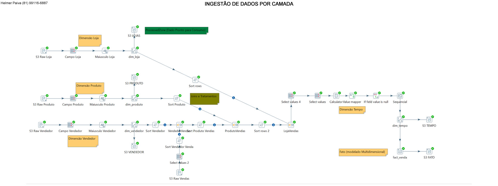
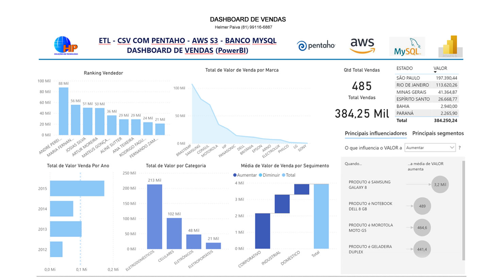

## Pentaho + AWS  + MySQL + PowerBI
Ingestão de Dados com Pentaho para o S3 (2 camadas Raw e Processed) Banco Mysql+Athena, Dashboard PowerBI

O trabalho consiste em simular um ambiente de Data Lake com 2 camadas onde a ultima camada é o espelho do Banco de dados e Resultado final em um Dashboard desenvolvido em PowerBI

*<n>Fonte de Dados CSV:</n> 
-Lojas.csv 
-Produto.csv 
-Vendas.csv 
-Vendedor.csv 

*ELT:  
-Camada RawZone (Dados puro igual a origem) 
-Camada Processed (Dados igual ao banco com possibilidade de acesso direto sem necessidade de um banco de dados SGBD) 

*Banco: 
-Mysql (opção por ser free, a modelagem é a mesma pra qualquer outra opção SGBD ou DW etc.) 

*Dashboard: 
-PowerBI 

*Desenho do projeto: 

 
*Desenho do ELT DataLake S3 com Pentaho PDI: 

 
*Dashboard Resultado final com tendencia de vendas: 

